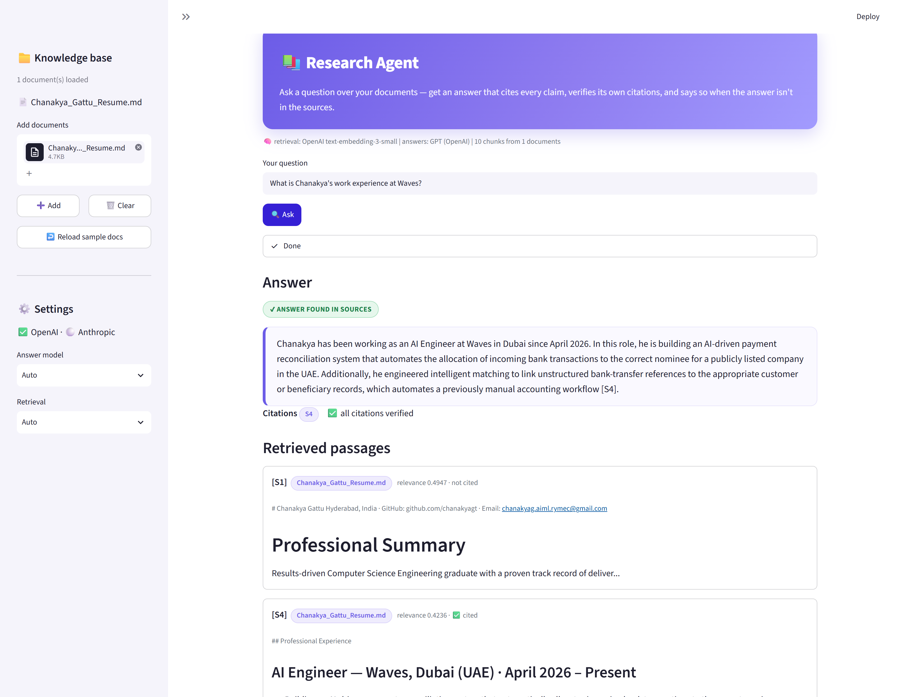

# Research Agent (with Citations)

**Rooman AI Challenge — Agent #12 (Voice & Agentic): Research Agent (with Citations)**

> My agent takes **a question + a set of source documents** and produces **a
> synthesised answer that cites which source each claim came from — and clearly
> says when the sources don't contain the answer.**

It chunks the sources, retrieves the most relevant passages using semantic
embeddings, asks an LLM to answer **using only those
passages** with inline `[S#]` citations, and then **verifies** that every citation
points at a passage that was actually retrieved — so a reviewer can trust the
answer isn't hallucinated.

---

## Why this is more than "ask an LLM"

Three design decisions make it a real research agent, not a chatbot:

1. **Grounded retrieval (RAG).** Answers are built only from passages retrieved
   from *your* documents — it has a knowledge base, not just parametric memory.
2. **Verified citations.** After generation, the agent parses every `[S#]` marker
   and checks it against the ids actually retrieved. A fabricated citation is
   detected and flagged — this is the honesty guarantee.
3. **Honest refusal.** When retrieval doesn't cover the question, the agent says
   *"not found in the provided sources"* instead of guessing. (Two sample
   questions are deliberately out-of-scope to demonstrate this.)

---

## See it in action

Ask a question over your documents → get a cited answer with a **verified**
citation, or an honest *"not in the sources"* when it can't find the answer.



📸 **New here? Follow the illustrated, click-by-click guide → [WALKTHROUGH.md](WALKTHROUGH.md)**
(API-key setup, uploading documents, and example runs with screenshots).

---

## Quick start

### 1. Install

```bash
git clone <your-repo-url>
cd rooman-research-agent
python -m venv .venv && source .venv/bin/activate     # Windows: .venv\Scripts\activate
pip install -r requirements.txt
```

Requires **Python 3.9+** (developed on 3.13).

### 2. Add your API key and run

```bash
cp .env.example .env      # paste your OpenAI key (Anthropic optional)
python ask.py "What is Chanakya's work experience at Waves?"
python ask.py --batch data/questions.txt --out samples/answers.md    # answer the whole set
```

**Which keys → what runs** (chosen automatically; override with `--llm` / `--embed`):

| Keys present | Retrieval | Answer |
|---|---|---|
| OpenAI (± Anthropic) | OpenAI embeddings | Claude if Anthropic key, else GPT |
| **OpenAI only** | OpenAI embeddings | **GPT** |

Placeholder values left in `.env` are treated as "not set", so a half-filled
`.env` won't be mistaken for a real key. An **OpenAI key is required** (it powers
retrieval embeddings); an Anthropic key is optional and switches answers to Claude.

### 3. Interactive GUI

```bash
streamlit run app.py
```

Ask a question, watch **Retrieving → Synthesising → Verifying**, and see the
cited answer plus every retrieved passage (the cited ones highlighted).

### 4. Run the tests (no key needed)

```bash
python tests/test_research.py        # or: python -m pytest -q
```

---

## What an answer looks like

*Here the agent is run over a résumé loaded into the knowledge base — see the
full screenshots in the [walkthrough](WALKTHROUGH.md).*

```
Q: what's his previous experience
[ANSWER FOUND IN SOURCES]

His previous experience includes:
- AI Engineer at Waves, Dubai (UAE) (April 2026 – Present): building an AI-driven
  payment reconciliation system that allocates incoming bank transactions and
  automates a manual accounting workflow [S4].
- Founder of BakiMedia: a YouTube-as-a-Service agency specializing in web scraping
  and portfolio development (2023–24, discontinued) [S9].
- Freelance Developer: completed multiple client projects, including a gym
  equipment repair service management system [S9].

Citations: S4, S9   (all citations verified)
```

And the honest-refusal case, when the document doesn't contain the answer:

```
Q: What is his current salary?
[NOT FOUND IN SOURCES]
I could not find his current salary in the provided sources.
Citations: (none)
```

Reference runs are committed in [`samples/`](samples/).

---

## Deliverables (as required for this agent)

| Deliverable | Where |
|---|---|
| A question set | [`data/questions.txt`](data/questions.txt) (incl. 2 out-of-scope) |
| Source documents | [`data/sources/`](data/sources/) — a résumé as the sample knowledge base |
| Cited answers | [`samples/answers_openai.md`](samples/answers_openai.md) |
| Retrieval/tool approach note | [`docs/RETRIEVAL.md`](docs/RETRIEVAL.md) |

---

## How it works

Full method note: [`docs/RETRIEVAL.md`](docs/RETRIEVAL.md).

```
sources ──chunk──▶ passages [S1..Sn]
question ──embed──▶ ─cosine top-k─▶ relevant passages
                                        │
                                        ▼  LLM (Claude / GPT)  — "answer ONLY from these, cite [S#]"
                                   { answer_found, answer, sources_used }
                                        │
                                        ▼  verify citations vs retrieved ids
                                   cited / valid / hallucinated  →  displayed
```

---

## Project layout

```
rooman-research-agent/
├── ask.py                       # CLI: one question or --batch
├── app.py                       # Streamlit GUI
├── research_agent/
│   ├── config.py                # models, chunking, top-k, key detection
│   ├── loader.py                # load .md/.txt/.pdf, split into citeable chunks
│   ├── embed.py                 # OpenAI embeddings + cosine similarity
│   ├── retrieve.py              # in-memory index + top-k cosine retrieval
│   ├── synthesize.py            # Claude / GPT answer generation
│   ├── citations.py             # parse + verify [S#] citations
│   └── pipeline.py              # ResearchAgent: index once, answer many
├── data/
│   ├── sources/                 # sample knowledge base (a résumé)
│   └── questions.txt            # sample question set (about the résumé)
├── tests/test_research.py       # offline tests (no key)
├── samples/                     # reference cited answers
├── docs/RETRIEVAL.md            # retrieval + citation method note
├── requirements.txt
└── .env.example
```

---

## Tradeoffs & what I'd improve with more time

**Model / approach choices**
- **Embeddings for retrieval, LLM for synthesis.** Semantic embeddings
  (`text-embedding-3-small`) find relevant passages even when wording differs;
  the LLM only *rewrites and cites* what was retrieved.
- **Two synthesis backends + auto-detect** (Claude ↔ GPT): Claude is used when its
  key is set, otherwise GPT.
- **Verification over trust.** Rather than assume the model cites honestly, the
  agent checks each `[S#]` against retrieved ids and flags fabrications.

**Known limitations (honest)**
- **Retrieval is the ceiling.** If the right passage isn't retrieved, the answer
  can't use it. Small `k` or a very large corpus can miss context; there's no
  re-ranking or query expansion yet.
- **In-memory index, re-embedded each run.** Fine for a modest document set;
  a persistent vector store (FAISS/Chroma) would be needed at scale.
- **Chunking is structural** (paragraph-packing), not semantic; a passage split
  mid-topic can weaken retrieval.
- **Citation check verifies *provenance*, not *entailment*.** It confirms a cited
  passage was retrieved, not that it fully supports the sentence — an NLI check
  would close that gap.
- **An API key is required.** Retrieval uses OpenAI embeddings and answers use an
  LLM, so there's no fully offline mode.

**What I'd add next:**
- A persistent vector DB (FAISS/Chroma) and a cross-encoder re-ranker.
- An NLI-based "does this passage actually support the claim?" check.
- Multi-hop questions that need several passages combined.
