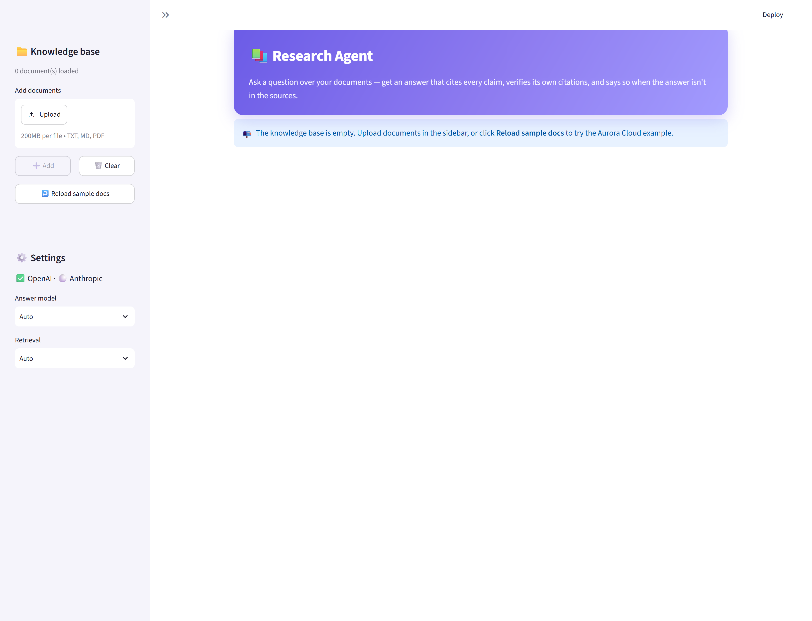
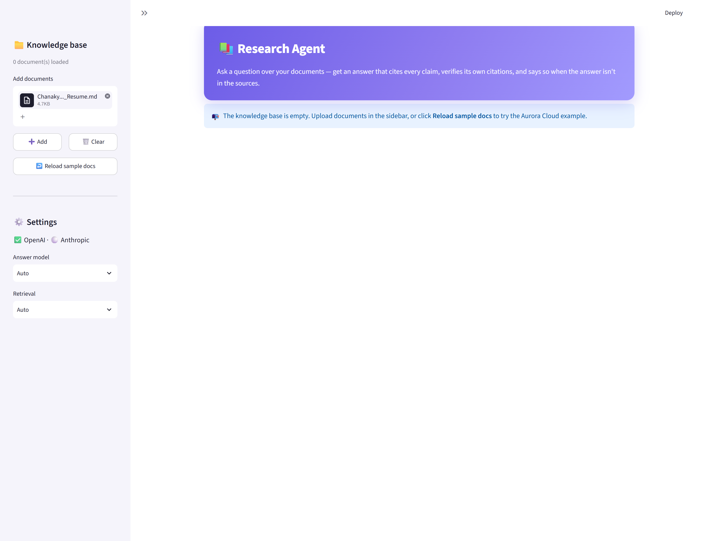
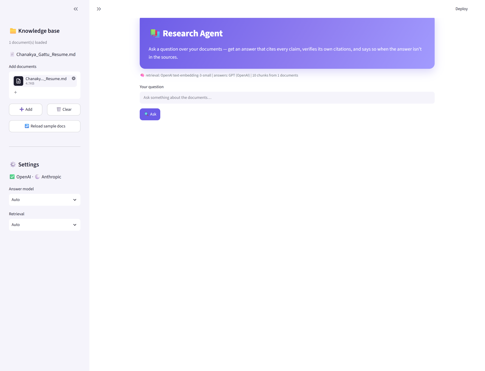
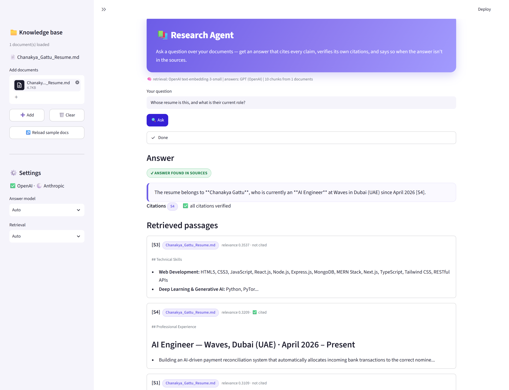
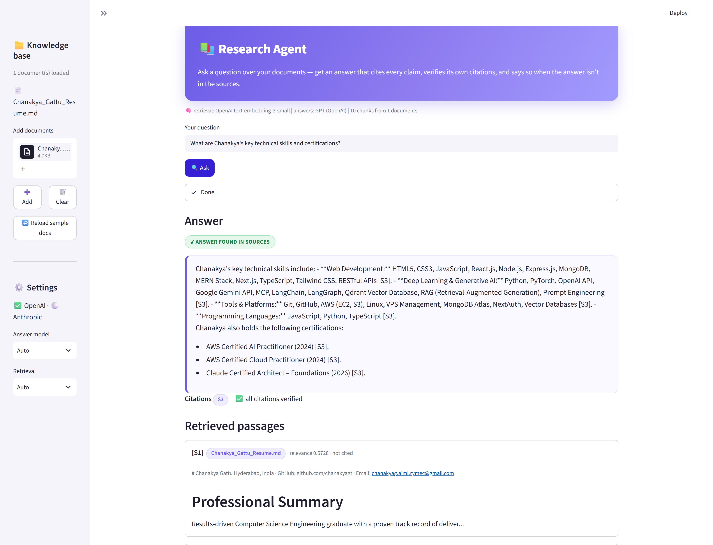
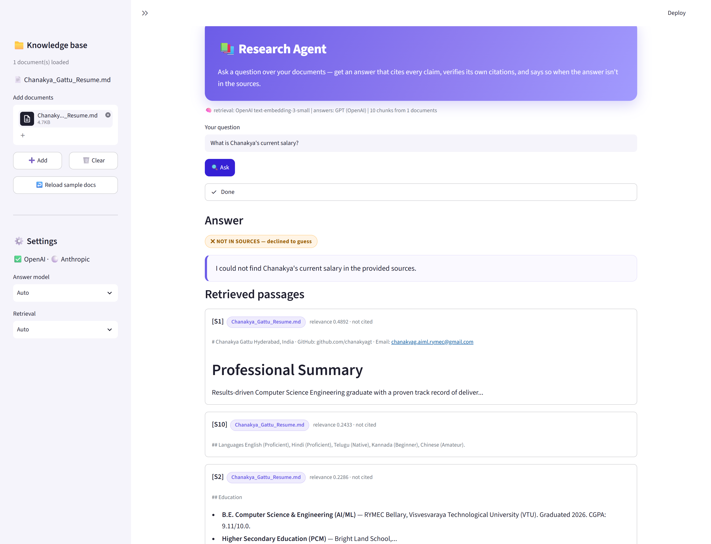
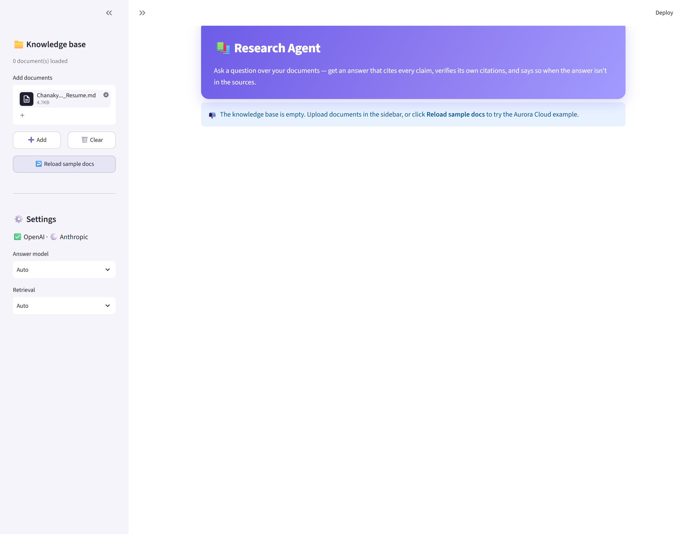

# 📚 Research Agent — Illustrated Walkthrough

A step-by-step guide to installing, configuring, and running the Research Agent,
with real screenshots. By the end you'll be asking questions over your own
documents and getting **cited, verified answers**.

> The screenshots below use a résumé as the knowledge base and ask questions
> about it — but the agent works with **any** `.txt`, `.md`, or `.pdf` documents.

---

## Step 1 — Get an API key

The agent needs **one** API key. It auto-detects what you have:

| Key | Used for | Where to get it |
|---|---|---|
| **OpenAI** (recommended, enough on its own) | Embeddings (retrieval) + GPT answers | [platform.openai.com/api-keys](https://platform.openai.com/api-keys) → **Create new secret key** |
| **Anthropic** (optional) | Claude answers (preferred if present) | [console.anthropic.com](https://console.anthropic.com/) → **API Keys** → **Create Key** |

An OpenAI key alone runs the whole thing (that's what these screenshots use).
The key looks like `sk-...`; copy it somewhere safe — you'll paste it in Step 3.

> 💡 You need credit on the account. Cost is tiny — indexing a résumé and asking
> a few questions is a fraction of a cent.

---

## Step 2 — Install

```bash
git clone https://github.com/<your-username>/rooman-research-agent.git
cd rooman-research-agent
python -m venv .venv
# Windows:
.venv\Scripts\activate
# macOS/Linux:
source .venv/bin/activate

pip install -r requirements.txt
```

Requires **Python 3.9+**.

---

## Step 3 — Add your API key

Copy the example env file and paste your key into it:

```bash
cp .env.example .env
```

Open `.env` in any editor and fill in the key(s) you have:

```ini
OPENAI_API_KEY=sk-your-real-key-here
# ANTHROPIC_API_KEY=sk-ant-...   # optional
```

Placeholders are ignored, so leaving a line unfilled is fine. Your `.env` is
git-ignored — your key will never be committed.

---

## Step 4 — Start the app

```bash
streamlit run app.py
```

It opens at **http://localhost:8501**. On first launch the knowledge base is
empty and you're prompted to add documents:



The left sidebar shows a green ✅ next to whichever API key it detected.

---

## Step 5 — Upload a document

In the sidebar under **Add documents**, click **Upload**, choose a `.txt`,
`.md`, or `.pdf` file, then click **➕ Add**. The file stages first…



…and once added, the knowledge base is indexed and shows your document loaded:



The line under the header confirms what's running, e.g.
*retrieval: OpenAI text-embedding-3-small · answers: GPT (OpenAI) · 10 chunks from 1 documents*.

---

## Step 6 — Ask questions and get cited answers

Type a question and click **🔍 Ask**. The agent retrieves the most relevant
passages, writes an answer, and **cites every claim** with `[S#]` markers that
map to the passages shown below.

**Example 1 — "Whose resume is this, and what is their current role?"**



**Example 2 — "What is Chanakya's work experience at Waves?"**


Notice the green **✔ ANSWER FOUND IN SOURCES** badge, the **`S4` citation chip**,
and **"✅ all citations verified"** — the agent checked that every citation
points at a passage it actually retrieved (no fabricated sources).

**Example 3 — "What are Chanakya's key technical skills and certifications?"**



---

## Step 7 — Honest refusal (the important part)

Ask something the documents **don't** contain — here, *"What is Chanakya's current
salary?"* Instead of guessing, the agent says so:



The amber **✖ NOT IN SOURCES — declined to guess** badge and *"I could not find …
in the provided sources"* are what make the answers trustworthy.

---

## Step 8 — Clear the knowledge base

Click **🗑️ Clear** in the sidebar to wipe all documents and start fresh
(or **↩️ Reload sample docs** to load the built-in example):



---

## Prefer the command line?

No GUI needed — the same engine runs from the terminal:

```bash
# Ask one question (auto-detects your keys):
python ask.py "What is Chanakya's work experience at Waves?" --sources data/kb

# Answer a whole file of questions and save them:
python ask.py --batch data/questions.txt --out samples/answers.md
```

---

## Troubleshooting

| Problem | Fix |
|---|---|
| "OPENAI_API_KEY is not set" | Make sure `.env` has your real key (not the placeholder) and you saved it. |
| Sidebar shows ❌ for both keys | The key wasn't detected — check for typos or extra spaces in `.env`. |
| `streamlit: command not found` | Activate your virtualenv and re-run `pip install -r requirements.txt`. |
| Answers seem wrong | Check the **Retrieved passages** panel — the answer only uses what was retrieved. |

That's it — you now have a working, citation-verified research agent over your own
documents. For the design details, see
[`README.md`](README.md) and [`docs/RETRIEVAL.md`](docs/RETRIEVAL.md).
